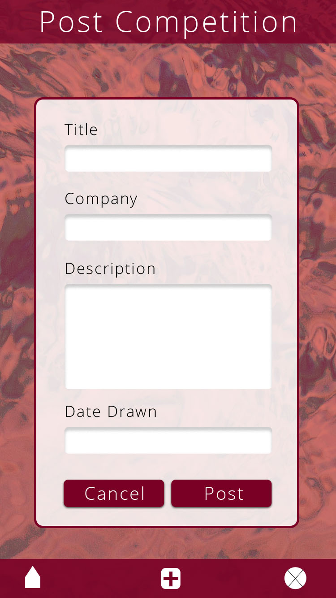
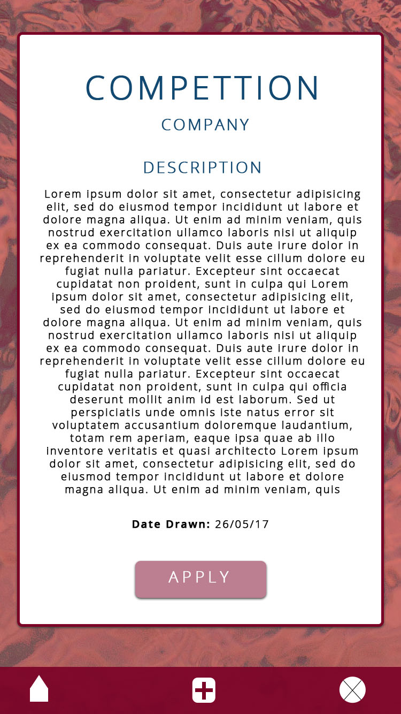

# Inspire
> Ruby on Rails app

*The Idea:*
  *For my project I wanted to build an application that would benefit aspiring writers. I wanted the users to be able to upload an excerpt of a novel they've written, interest other users and have the possibility of income with users buying the full versions. I wanted to expand this further to job opportunities. I decided that I would integrate a jobs section that would allow users to just click 'apply' and their information would be directly sent to the employer. From there the employer can view all the posts they've made, reviewed and liked. I also wanted to make it a bit more fun with a competition section. I firstly restricted these to fields allowing only businesses that sign up being able to make job and competition posts but no novel posts. Later, I agreed with my tutor that this produced limitations within my app and I decided to give each user the ability to create any type of post, with the decision to sign up as a writer, business or critic was later scrapped.*

  ----------------------------------------------------------------------------------

# Contents
  - Inspiration
  - Wireframes
  - Production Plan
  - Changes
  - Challenges
  - Product link
  - Improvement for next time

  ----------------------------------------------------------------------------------

# Inspiration

*Below I have incorporated some of my inspiration for my app. I explored the fundamentals of the API applications and user interfaces of both Instagram and Facebook and somewhat of LinkedIn.*

-  
-  
-  

Instagram has many great features, the app enables the user to search by; location, tags, usernames/actual names, follow users, contact them and tag them in posts, either one the user has made or in a comment. What appeals me to Instagram is its easy user experience, its simplistic and not complicated, quite straightforward.  Facebook is VERY much simpler. Facebook allows the users to become friends which is much like the follow method on Instagram and connect option n LinkedIn. One thing that really stuck out about Facebook was its ability to have changeable newsfeeds; defaulted and customizable ones by the user.

After looking closely at these two apps, for my app, I'd like the user to be able to search specific for the page. For example if they are on the Job's page, the will only be given results with jobs relating to the title, experience level and location. I also want to implement a follow option, that will then give the user a 'following feed' with the root page displaying all users posts. This follow option will be found on their profile and will be located next to a contact button. Like Facebook, I would like to implement a Top Stories and Most Recent newsfeed filter.

I like how all applications use a simplistic icon navigation system at the bottom of the screen page on mobile. I would like to keep this idea consistent across all screen sizes with possibly having the bottom navigation, stick to the right hand side at approx. 800px+ width.

Having a look at LinkedIn, I really liked the interface of the profile page. I liked the idea of having a round picture with a frame including the person's full name, location, connections and beginning of a bio. I'm thinking of using a similar design.

The user will be able to have...
- A username, but with the ability to login with email or username
- A profile picture
- A record of their posts, reviews and likes accessible from their profile
- Feed filters, eg; posts, jobs, competitions and top stories and most recent
- Ability to view other users profiles
- Ability to follow a user
- Ability to contact user
- Ability to apply for jobs and competitions
- Search specific to the page
- Ability to buy full versions of novels
- Ability to like a post
- Ability to review and rate a post
- Ability to report inappropriate comments
- Ability to see overall rate of a post
- Biography

I'm more leaning to creating my app with a closely feel of Instagram for the as I feel like the design in place is more inviting than Facebook and Linkedin with its use of color.

------------------------------------------------------------------------------------
# Wireframes
*For the creation of my wireframes, I used Photoshop.*
*Across all media platforms I wanted to keep my design simple and easy to use.*

iPhone 6
>Sign Up process

>This is the Sign Up page. As you can see its very simple and easy to use. I kept this same structure and design throughout all media platforms. I decided to use an image behind the sign up box with a color fill as I think it adds a nice touch, its inviting and the coffee and boo highlights relaxation. The use of this blue will become a color theme within my app.

>I want the user to click the sign up button and then be brought to this page where they will fill out their personal details and chose a password. The will have the option to continue or cancel. Again I have used a background image with a colour fill, this time purple.

>This is the second process of the sign up, you will chose a username, chose what you are and upload a profile picture. You will again have the option to continue or cancel. I kept the same image and colour fill as they are related pages.

>This is the third and final process of the sign up, this is where you will create your monthly subscription. You will again have the option to continue or cancel. I kept the same image and colour fill as they are related pages.

>Once sign up is successfully the user will be sent to this page. I have decided to use a different image at this stage and a red colour fill.

> Newsfeeds

>This is the post feed. This will be the root page of my site. To keep color consistency I have used the same blue at the login page to theme this page. As you can see, I have show what the navigation will look like for changing to top stories or most recent and what kind of newsfeed is displayed.

>Again keeping within the colors I have chosen, the Following feed will be themed purple. As you can see the highlighted area (if your a business) has given you the option to post a job or competition (after clicking the + sign in the middle of the bottom nav). This is still a functional feature, however the decision to all users to create all types of posts has been made. Edit seen in wireframes made below.

>For Jobs, I used a color theme that would go nicely with both the purple and blue chosen for previous pages. As you can see I have created the posts in two columns, I later realized this will become an issue for readability on such mobile as the iPhone six. Changes where later made to have one post across full page, the columns will be seen on desktop and iPad retina.

> The colour scheme for competitions is the same of that of the congratulations page. Again like jobs, the two column split for mobile of this size will be edited.

>Creating Posts
I have kept the colour scheme of newsfeeds related to the creation of post.

> This wireframe is of the process to create a general post of a novel the user has created. It includes Title, bibliography, genre, excerpt.

> This wireframe is of the process to create a job. I've made it simple and user friendly.

> I used the same approach as the creating job post page, keeping it minimal and user-friendly.

>View Postings
These wireframes show how the user will see a post created.
Again I have related the pages to their chosen colour scheme.

>Profile
I have decided to scheme the profile in the blue colour seen on the home page.

> This wireframe is of the profile page, that will default to the posts created by the user. You will be able to interchange the view to reviews and likes of the user, see below.
NOTE on the wireframes I have a 'Star' as one of the icons, this will change to a a heart, much like Instagram.

 

>Add Review
This is how my 'add review' page will look to the user. I have kept this simple, clean and easy to use.

>Ipad Retina
I've decided to display these wireframes to show the responsive design and how elements will be displayed from 800px+

>Please refer to images for further wireframes of different screens.

------------------------------------------------------------------------------------

#Production Plan
*Trello Board*
insert link
*Database Design*
insert image
*Ruby on Rails will be the platform used in the production of my app*
*Ruby Gems I will use*
- Devise (tailored to desired use)
- Mailgun
- Paperclip or Carrierwave
- Stripe & DotEnv
- Bootstrap

*Other requirements...*
- Search
The search will be relevant to the page the user is viewing.
- Use of Postgres Database
- Deploy on Heroku
- Clean and readable code

*Styling*
- Bootstrap
All though having never used bootstrap I hope to be able to use this effeciently in my styling.

------------------------------------------------------------------------------------

#Changes
- Signup Page.
> I decided to let go of the idea of defining the user as a writer, business or critic as it creates limitations and these categories could possibly interrelate in my app.

- Profile Page.
> Much similar to Linkedin, I have decided that the user will be able to add a bio.
NOTE this change is yet to be implemented.
I have alos decided to change the star icon to a heart as it could cause confusion in relation to the rating system I will be implementing.

#Challenges
- Devise.
For my application I was adamant to have the user to have a functional username that will display on posts and will allow the user to sign in accordingly.
I had many issues with this, which caused most of my time delay in creating most of the basic shell of my app. The user would appear in the console when called, however on the server I would have an error that would display that the user 'did not exist'. This was the product of many faults within my code, however going through this with my tutor made it clear where I had gone. The error then appeared again when I tried to link the profile set-up page from the sign_up_path. However was quickly resolved by eliminating typos. *Issue Solved*
- ImageUploader (Carrierwave)
I was stuck on this, believing I had done everything to script. The issue I was getting was the image path being displayed not the image itself, this was later discovered due to not using an image tag that I mistakenly had not included within my code. *Issue Solved*
- Search
I had a small issue with this, was much simplier than first thought. The issue was that I had 4 search hashes when I was only specifying 3. This threw a binary error. In removing what wasn't needed. The code I sourced was fantastic. *Issue Resolved*
- Stripe
I have not fully finished all the Stripe integration that I plan to however, I have now successfully implemented the subscription page. I was at a wits-end with discovering what was wrong. I went over my code time and time again and could not work out what the issue was within. It was actually something so simple. So when the user had filled out their information it was going to a blank page. This was easily resolved by a missing '/' in front of the path redirection. Fixing this made my subscription page viewable and like I thought, it was properly integrated and worked as desired. *Issue Solved*
- Nav Bar
I'm currently implementing the navigation bar, in particular for screens 800px+ in width for the current moment. I'm presently experiencing issues in having it stick efectivley to the side of the web page if the user minimizes or stretches the page and this is a style that I would like to effectively complete. *In progress*
- Genre Feild.
Within my Post scaffold, I seemingly forgot to add the genre feild. I tried to fix this, but hadn't done so properly. With the help of my tutor, I discovered that when adding something that will be in the database, you need to drop the database, add the information and migrate. Doing so easily resolved my issue. *Issue Resolved*

------------------------------------------------------------------------------------

### Product Link
https://inspire3.herokuapp.com/
------------------------------------------------------------------------------------

#Overview and Improvements for next time
At this current stage, Im still in the very beginning of the creation of 'Inspire'
I have generated scaffolds for all the Posts, Jobs and Competition pages; post, edit and view in the feed and once clicked, though are yet to be styled in accordance to my wireframes. I am able to successfully sign up, set up my profile page and start a subscription. Once signed in I'm able to create a general post and post jobs and competitions. In addition to this, I am able to search in accordance to the page. I had hoped to get most of my app created and functioning as desired, however my desire to have the username really constrained my time. Next time, I have decided to try if wanted again, however if such issues again happen, to go ahead with creating my app and implement later. That way I will have an app that will hopefully be more extensive and reflective of my wireframes. Although I had minimal areas of my app created, I still beleive this project gave me the opportunity to learn more and learn more effeciently. In the process of creating my app, I really wanted to give myself a chance, for a period of time to resolve the issue myself before askin for help in the hope to get more skillful in resolving issues. When I did get help, the help I received was great and did give me insight into what was wrong and was helpful for improvements on the next project.
I do hope to have this app fully functioning in time.

------------------------------------------------------------------------------------
>Paige Richards
